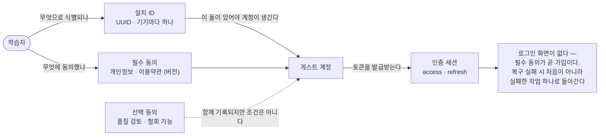
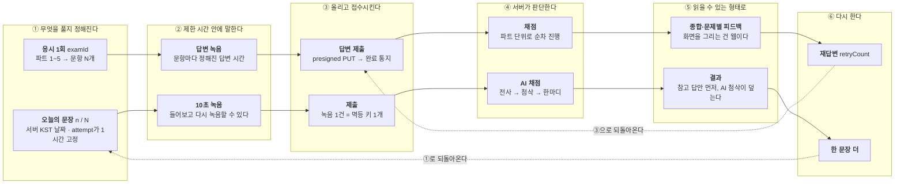
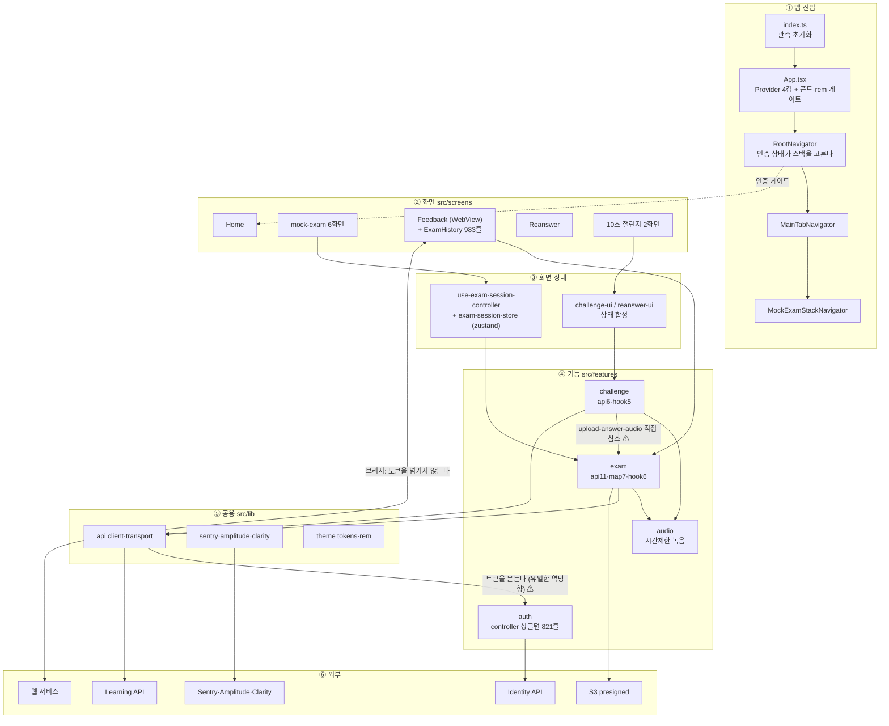
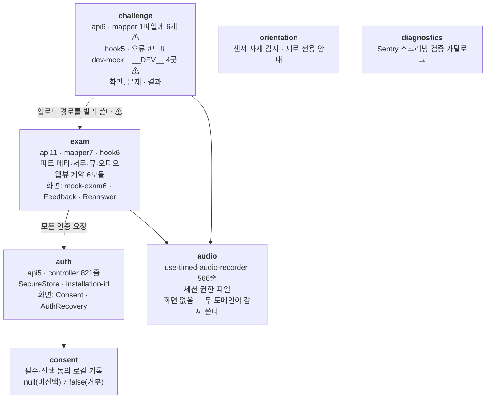
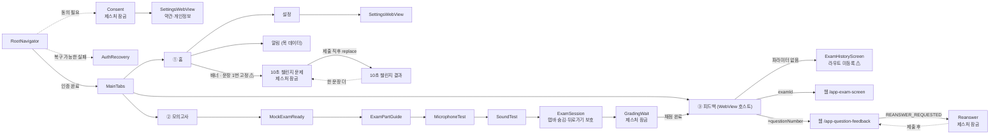

# 같은 그림 4장 · Mermaid 판

오늘의 정본은 `../diagrams/*.drawio`다. 이건 형식을 비교해 보기 위한 것으로,
GitHub·Notion·VS Code에서 그대로 렌더된다. 레이아웃을 손으로 잡을 수 없어
draw.io판보다 정보가 덜 들어간다.

---

## 1. 컨셉맵

왼쪽에서 오른쪽으로 한 번만 읽으면 끝난다. 각 칸의 위/아래 두 상자는 **같은 단계를 지나는
서로 다른 학습 루프**다 — 모양이 같아서 코드도 닮았고, 그래서 이름이 겹치는 문제가 생겼다.

### 1-1. 먼저 한 번만 — 앱을 쓸 수 있게 되기까지

### 1-2. 여섯 단계 — 위는 모의고사, 아래는 10초 챌린지

### 1-3. 두 줄을 세로로 비교하면

| 단계 | | 무엇이 같고 다른가 |
|---|---|---|
| ① | **다르다** | 시험은 examId 하나로, 챌린지는 날짜 하나로 묶인다. 둘 다 앱이 만들지 않는다 |
| ② | **같다** | 녹음은 훅 하나(`use-timed-audio-recorder`)가 담당한다. 어댑터만 다르다 |
| ③ | **같다** | 업로드 경로가 같다. 챌린지가 시험 쪽 모듈을 그대로 가져다 쓴다 |
| ④ | **다르다** | 시험은 파트별 진행률이 보이고, 챌린지는 되거나 안 되거나뿐이다 |
| ⑤ | **다르다** | 시험 피드백은 웹이, 챌린지 결과는 앱이 그린다. 같은 "첨삭"을 두 번 구현했다 |
| ⑥ | **같다** | 되돌아오는 길이 있다. 시험은 ③으로, 챌린지는 ①로 |

### 1-4. 여섯 단계 전부에 걸리는 것

| | 내용 |
|---|---|
| 신원과 토큰 | 모든 요청에 세션이 실린다. 만료되면 한 번만 재발급, 실패하면 게이트로 |
| 시간의 정본 | 언제나 서버 — 챌린지 날짜 · 제출 기한 · URL 만료. 앱은 자정을 계산하지 않는다 |
| 관측 | ②③④에서 **흐름을 막은 실패**만. ⚠ 챌린지 줄은 아직 이 표에 없다 |
| 화면 규율 | 토큰 한 벌 · rem 스케일(웹뷰까지) · 세로 전용(Part 4 표만 예외) |

## 2. 아키텍처

## 3. Feature map

## 4. IA

