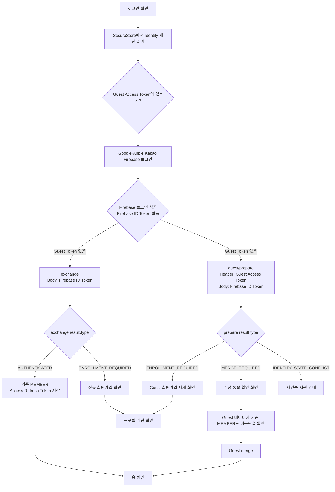
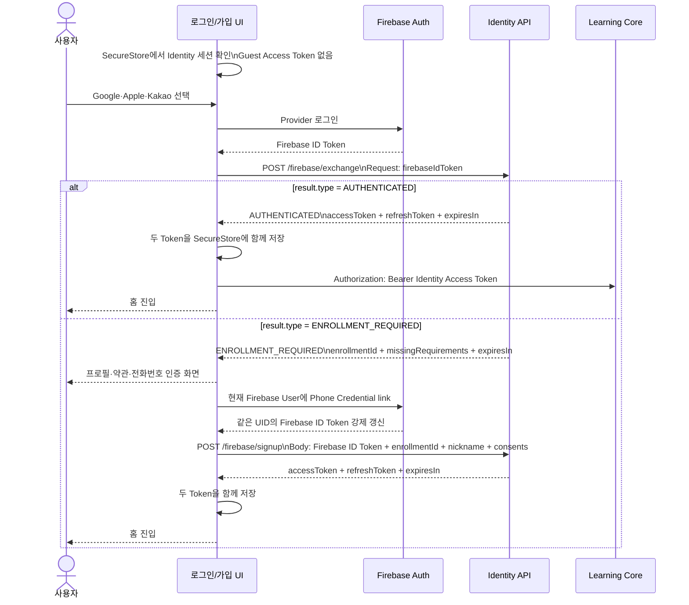
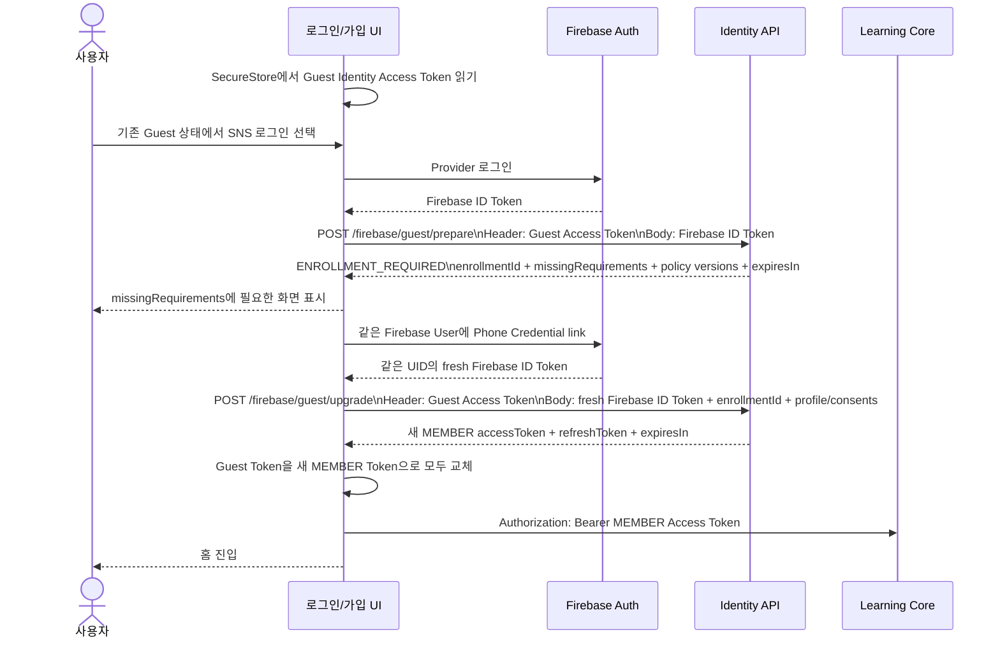
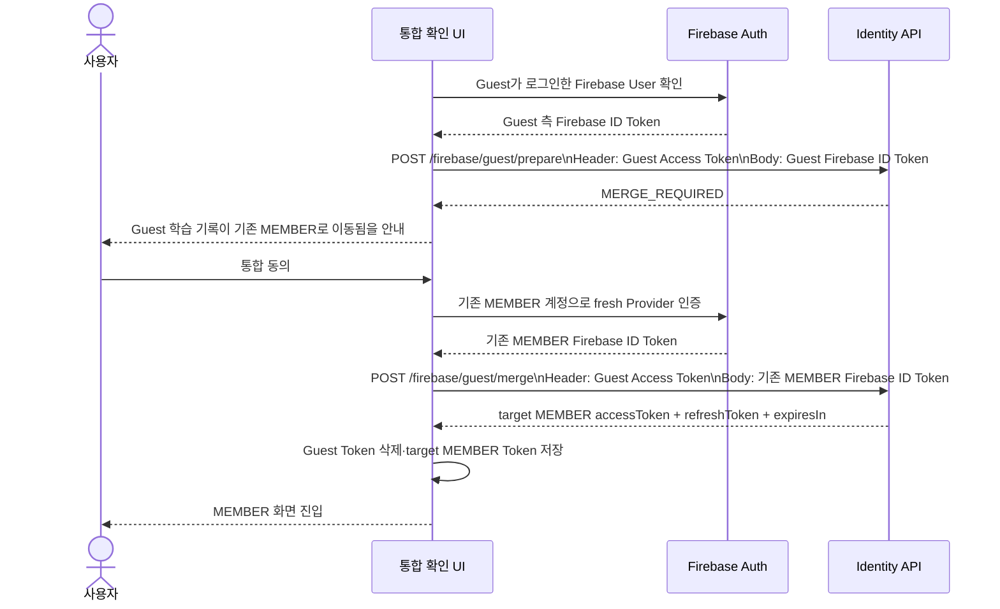
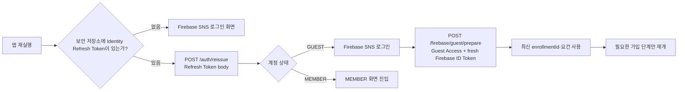

# Firebase·SNS 로그인 흐름과 Token 경계

기준 문서: 2026-09-21 Firebase·SNS 로그인 및 회원 전환 연동 가이드

이 문서는 화면 흐름을 이해하기 위한 그림이다. 실제 서버 활성화 여부와 Firebase Provider 설정은 배포 환경에서 별도로 확인한다.

## Token 종류

| 이름 | 발급 주체 | 보내는 곳 | 화면에서의 역할 |
|---|---|---|---|
| Firebase ID Token | Firebase Auth SDK | `exchange`, `signup`, `guest/prepare`, `guest/upgrade`, `guest/merge` 등의 요청 증명 | 현재 Firebase User가 누구인지 증명 |
| Firebase Phone Credential | Firebase Phone Auth SDK | 현재 Firebase User의 `linkWithCredential` | 전화번호 가입 proof. 서버 API에 직접 보내지 않음 |
| Identity Access Token | Identity API | `Authorization: Bearer ...`로 보호 API와 Learning Core | 우리 서비스의 현재 사용자 권한 증명 |
| Identity Refresh Token | Identity API | `reissue`, `logout`, `withdraw` | 새 Identity Token 발급·세션 종료. 일반 API에는 보내지 않음 |

Firebase ID Token과 Identity Access Token은 서로 바꿔 사용할 수 없다. Firebase ID Token을 Learning Core에 보내지 않고, Identity Access Token을 Firebase 교환 API의 `firebaseIdToken`으로 보내지 않는다.

## 화면 진입 분기

분기 전에 앱이 SecureStore에서 **Identity 세션**을 읽는다. 이 값은 Firebase가 발급한 값이 아니다.

- Guest Access Token 있음: 이전에 같은 설치에서 Guest로 사용한 서버 세션이 있음
- Guest Access Token 없음: 서버 Guest 세션을 복구하지 못했거나 처음 SNS 로그인하는 상태

그 다음 Firebase SDK로 Google·Apple·Kakao 로그인을 수행해 Firebase ID Token을 받는다. Firebase SDK에 “Guest Identity Token이 있는가?”를 묻는 API는 없다.



## A. Guest 세션이 없는 신규·기존 SNS 사용자



이 흐름에서는 Guest Access Token을 보내지 않는다. `exchange`에서 받은 enrollment는 direct `/firebase/signup`에만 사용한다.

## B. 기존 Guest를 새 MEMBER로 승격



`prepare` 응답의 `missingRequirements`는 서버가 저장한 화면 번호가 아니다. 현재 충족해야 하는 요건의 집합이며, `enrollmentId`는 `/guest/upgrade`에 그대로 보낸다.

## C. Guest와 기존 MEMBER를 통합



`MERGE_REQUIRED`에는 `enrollmentId`가 없다. 프론트가 이메일·전화번호·닉네임으로 대상 MEMBER를 추정하지 않는다.

## 앱 재실행·가입 재개



`enrollmentId`가 만료됐거나 `FIREBASE_ENROLLMENT_CONFLICT`가 발생하면 기존 ID로 반복하지 않는다. 현재 Guest Token과 fresh Firebase proof로 `prepare`를 다시 호출한다.

## 보호 API 요청 규칙

```text
Firebase 로그인·가입 증명
  Firebase ID Token → Identity의 Firebase endpoint body

우리 서비스 사용자 권한
  Identity Access Token → Authorization: Bearer header

세션 재발급·로그아웃·탈퇴
  Identity Refresh Token → 해당 endpoint의 body
```

Refresh Token은 일반 API나 Learning Core에 보내지 않는다. Firebase ID Token도 장기 세션 Token처럼 직접 저장하지 않고 Firebase SDK에서 필요할 때 다시 받는다.
